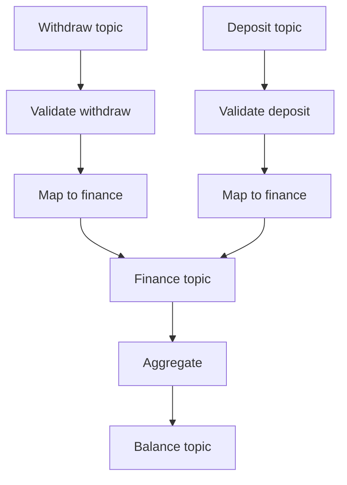

## Kafka Streams Demo App - account balance
### About project
This is demo application created to present functionalities of Kafka Streams library.
Application reads data from two topics: deposit and withdraw. Events which are pushed to
this topics should have the following structure:
```json
  {
      "accountId": 1,
      "amount": 300.0
  }
```
Received events are validated. Events with amount which is less than zero are filtered out.
Then messages received from both topics are converted into following format:
 - For deposits:
```json
{
  "accountId": 1,
  "amount": 300.0,
  "type":"DEPOSIT"
}
```
- For withdraw (structure is the same as above, but type is different and amount is negative):
```json
{
  "accountId": 1,
  "amount": -300.0,
  "type":"WITHDRAW"
}
```
Formatted events are pushed to topic "finance". At the these events are aggregated and
pushed to kafka topic "balance" with following structure:  
```json
{
  "accountId": 1,
  "balance": 350,
  "operationsCount": 3
}
```
### Prerequisites
- Docker
- Java 17
### How to run app?
1. Run docker-compose from main directory
2. Run class Main.java
3. Open Kafka UI in the browser (http://localhost:8090)
4. Push some events to topics: deposit and withdraw from Kafka UI

### Diagram

